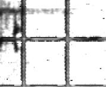
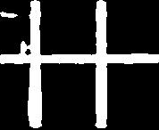
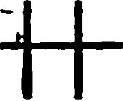
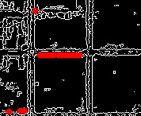
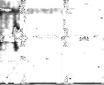
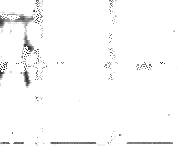

# 变量说明
* 原图 src0
* 原图拷贝 src
* 深度学习模型预测后 mask
* 霍夫P线检测后 cdstP

# 判断条件提高网格去除精度：
* 1、对 mask 中的白色部分，src 设置为白
* 2、对 cdstP 中的红色部分，src 设置为白
* 3、以上两个条件判断后，输出 src 作为最终结果

# demo
* 原图

 

* 深度学习分割预测结果

 

* 深度学习分割预测结果反色

 

* 霍夫P线检测算法结果

 

* 综合条件判断后结果

* 与原图叠加后最终结果

