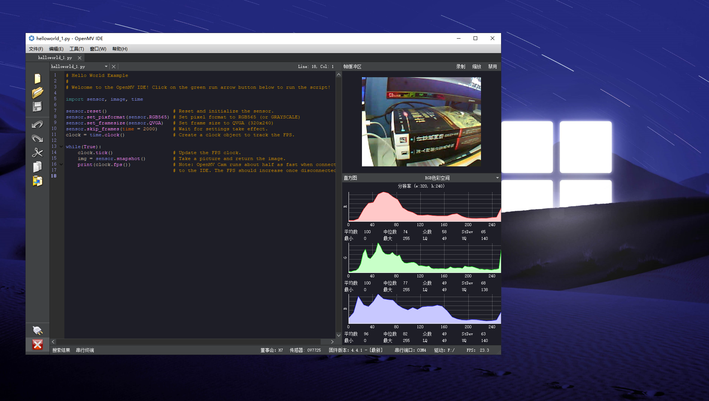
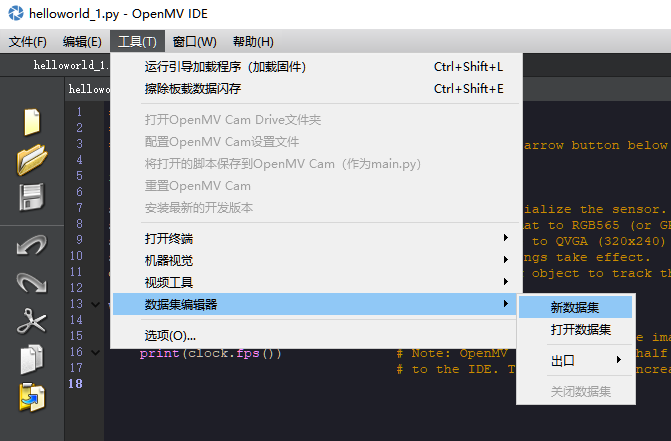

# 基于OpenMV的深度学习demo
* 参考资料
  * https://book.openmv.cc/quick-starter.html
  * https://book.openmv.cc/
  * https://github.com/openmv/openmv  
  * tf-lite教程
    * https://tensorflow.google.cn/lite?hl=zh-cn
    * https://github.com/tensorflow/models
    * https://hub.tensorflow.google.cn/
      * 提供大量预训练模型
  * tf-lite口罩识别教程：
    * https://singtown.com/learn/50872/  
    * https://github.com/SingTown/mask-tflite
  * 垃圾分类
    * https://github.com/SingTown/rubbish-tflite

## 备注
* 下载专用于OpenMV编程的IDE
  * https://singtown.com/openmv-download/  
* 脱机运行
  * OpenMV把内置Flash虚拟成一个文件系统，当你插入OpenMV到电脑上的时候，电脑会弹出一个U盘！里面就是OpenMV的文件系统。当你想烧录固件的时候，直接把脚本文件复制到这个“U盘”的main.py中。每次上电的时候，OpenMV会自动运行里面的main.py，这样就实现了脱机运行。  
* SD卡扩容
  * SD卡也是一个文件系统，当上电的时候，如果插入SD卡，那么SD卡的文件系统就会自动取代内置的Flash文件系统，每次上电，就会运行SD卡中的main.py啦，是不是很直观，很方便。SD卡最大支持32G的容量。

* 训练tf-lite轻量级神经网络
  * 只有OpenMV4 H7 plus可以使用
  * 对OpenMV4 H7 的模型有点大小限制
    * https://docs.openmv.io/library/omv.tf.html
    * The OpenMV Cam M7 has about 384KB of frame buffer RAM. Please try to keep your model and it’s required scratch buffer under 320 KB.
    * The OpenMV Cam H7 has about 496KB of frame buffer RAM. Please try to keep your model and it’s required scratch buffer **under 400 KB.**
    * The OpenMV Cam H7 Plus has about 31MB of frame buffer RAM. That said, running a model anywhere near the that size will be extremely slow.
  * 
  * EDGE IMPULSE平台训练模型
    * 全部是简单的一些可视化界面设置，不需要写代码