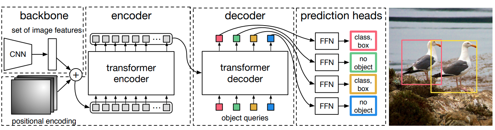
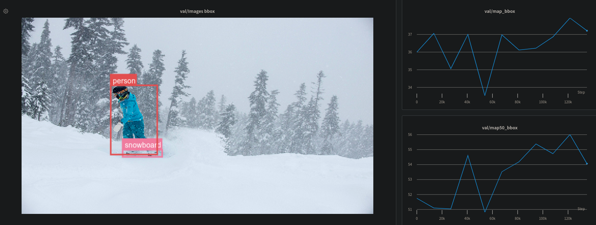
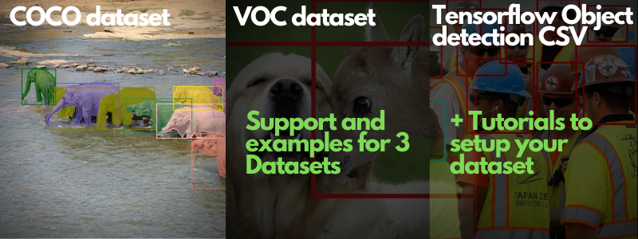
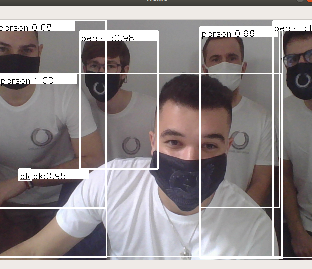

# DETR : End-to-End Object Detection with Transformers (Tensorflow)

Tensorflow implementation of DETR : Object Detection with Transformers, including code for inference, training, and finetuning. DETR is a promising model that brings widely adopted transformers to vision models. We believe that models based on convolution and transformers will soon become the default choice for most practitioners because of the simplicity of the training procedure: **NMS and anchors free!** Therefore this repository is a step toward making this type of architecture widely available. 

DETR 的 Tensorflow 实现：使用 Transformers 进行对象检测，包括用于推理、训练和微调的代码。DETR 是一个很有前途的模型，它将被广泛采用的转换器引入视觉模型。我们相信基于卷积和变换器的模型将很快成为大多数从业者的默认选择，因为训练过程非常简单：**NMS and anchors free**！因此，这个存储库是朝着使这种类型的架构广泛可用的一个步骤。

* [1. 安装](#install)
* [2. 数据集](#datasets)
* [3. 教程](#tutorials)
* [4. 微调](#finetuning)
* [5. 训练](#training)
* [5. 推理](#inference)
* [6. Acknowledgement](#acknowledgement)


<b>DETR paper:</b> https://arxiv.org/pdf/2005.12872.pdf <br>
<b>Torch implementation: https://github.com/facebookresearch/detr</b>

</img>

<b>About this implementation:</b> This repository includes codes to run an inference with the original model's weights (based on the PyTorch weights), to train the model from scratch (multi-GPU training support coming soon) as well as examples to finetune the model on your dataset. Unlike the PyTorch implementation, the training uses fixed image sizes and a standard Adam optimizer with gradient norm clipping.

**关于此实现**：此存储库包含使用原始模型的权重（基于 PyTorch 权重）运行推理的代码，从头开始训练模型（即将推出多 GPU 训练支持）以及在您的模型上微调模型的示例数据集。与 PyTorch 实现不同，训练使用固定图像大小和具有梯度范数裁剪的标准 Adam 优化器。

此外，我们的日志系统基于 https://www.wandb.com/，因此您可以很好地可视化模型性能！

在此处查看我们的日志记录板和报告：https://wandb.ai/thibault-neveu/detr-tensorflow-log

</img>

## Install

该代码目前已使用 **Tensorflow 2.3.0** 和 **python 3.7** 进行了测试。需要以下依赖项。

```
wandb
matplotlib
numpy
pycocotools
scikit-image
imageio
pandas
```

```
pip install -r requirements.txt
```


## Datasets

该存储库目前支持三种数据集格式：**COCO、VOC**和**Tensorflow Object detection csv**。最简单的入门方法是根据其中一种格式设置数据集。除了数据集，我们还提供了一个代码示例来微调您的模型。最后，我们提供了一个 jupyter notebook 来帮助您了解如何加载数据集、设置自定义数据集和微调您的模型。

</img>

## Tutorials

- ✍ [Finetuning tutorial.ipynb 微调](https://github.com/Visual-Behavior/detr-tensorflow/blob/main/notebooks/DETR%20Tensorflow%20-%20%20Finetuning%20tutorial.ipynb)
- ✍ [How to setup a custom dataset.ipynb 设置自定义数据集](https://github.com/Visual-Behavior/detr-tensorflow/blob/main/notebooks/DETR%20Tensorflow%20-%20%20How%20to%20setup%20a%20custom%20dataset.ipynb)

以及 wandb 上的日志记录板 https://wandb.ai/thibault-neveu/detr-tensorflow-log 和这份报告：

- 🚀 [Finetuning DETR on Tensorflow - A step by step guide  在 Tensorflow 上微调 DETR - 分步指南](https://wandb.ai/thibault-neveu/detr-tensorflow-log/reports/Finetuning-DETR-on-Tensorflow-A-step-by-step-tutorial--VmlldzozOTYyNzQ)


## Evaluation

Run the following to evaluate the model using the pre-trained weights. 
- **data_dir** is your coco dataset folder
- **img_dir** is the image folder relative to the data_dir
- **ann_file** is the validation annotation file relative to the data_dir

运行以下命令以使用预训练的权重评估模型。
data_dir是你的 coco 数据集文件夹
img_dir是相对于 data_dir 的图像文件夹
ann_file是相对于 data_dir 的标注文件

Checkout ✍ - ✍ [How to load a dataset.ipynb 加载数据集](https://github.com/Visual-Behavior/detr-tensorflow/blob/main/notebooks/How%20to%20load%20a%20dataset.ipynb)

```
python eval.py --data_dir /path/to/coco/dataset --img_dir val2017 --ann_file annotations/instances_val2017.json
```

Outputs:
```
       |  all  |  .50  |  .55  |  .60  |  .65  |  .70  |  .75  |  .80  |  .85  |  .90  |  .95  |
-------+-------+-------+-------+-------+-------+-------+-------+-------+-------+-------+-------+
   box | 36.53 | 55.38 | 53.13 | 50.46 | 47.11 | 43.07 | 38.11 | 32.10 | 25.01 | 16.20 |  4.77 |
  mask |  0.00 |  0.00 |  0.00 |  0.00 |  0.00 |  0.00 |  0.00 |  0.00 |  0.00 |  0.00 |  0.00 |
-------+-------+-------+-------+-------+-------+-------+-------+-------+-------+-------+-------+

```

The result is not the same as reported in the paper because the evaluation is run on the <b>original image size</b> and not on the larger images. The actual implementation resizes the image so that the shorter side is at least 800pixels and the longer side at most 1333.

结果与论文中报告的不同，因为评估是在原始图像大小而不是更大的图像上运行的。实际实现调整图像的大小，使短边至少为 800 像素，长边至多为 1333。

## Finetuning

To fine-tune the model on a new dataset we siply need to set the number of class to detect in our new dataset (**nb_class**). The method will remove the last layers that predict the box class&positions and add new layers to finetune.

要在新数据集上微调模型，我们只需设置要在新数据集中检测的类数（**nb_class**）。该方法将删除预测框类和位置的最后一层，并添加新层以进行微调。

```python
# Load the pretrained model
detr = get_detr_model(config, include_top=False, nb_class=3, weights="detr", num_decoder_layers=6, num_encoder_layers=6)
detr.summary()

# Load your dataset
train_dt, class_names = load_tfcsv_dataset(config, config.batch_size, augmentation=True)

# Setup the optimziers and the trainable variables
optimzers = setup_optimizers(detr, config)

# Train the model
training.fit(detr, train_dt, optimzers, config, epoch_nb, class_names)
```
The following commands gives some examples to finetune the model on new datasets:  (Pacal VOC) and (The Hard hat dataset), with a real ```batch_size``` of 8 and a virtual ```target_batch``` size (gradient aggregate) of 32. ```--log``` is used for logging the training into wandb. 

以下命令给出了一些在新数据集上微调模型的示例：(Pacal VOC) 和 (The Hard hat dataset)，实际batch_size为 8，虚拟target_batch大小（梯度聚合）为 32。--log用于将训练记录到 wandb .

- **data_dir** is your voc dataset folder
- **img_dir** is the image folder relative to the data_dir
- **ann_file** is the validation annotation file relative to the data_dir

data_dir是你的 coco 数据集文件夹
img_dir是相对于 data_dir 的图像文件夹
ann_dir data_dir 的标注文件夹

```
python finetune_voc.py --data_dir /home/thibault/data/VOCdevkit/VOC2012 --img_dir JPEGImages --ann_dir Annotations --batch_size 8 --target_batch 32  --log

```
- **data_dir** is the hardhatcsv dataset folder
- **img_dir** and  **ann_file** set in the training file to load the training and validation differently

data_dir是 hardhatcsv 数据集文件夹
训练文件中设置的img_dir和 ann_file以不同方式加载训练和验证

Checkout ✍ - ✍ [How to load a dataset.ipynb 加载数据集](https://github.com/Visual-Behavior/detr-tensorflow/blob/main/notebooks/How%20to%20load%20a%20dataset.ipynb)

```
python  finetune_hardhat.py --data_dir /home/thibault/data/hardhat --batch_size 8 --target_batch 32 --log
```

## Training

- **data_dir** is the coco dataset folder
- **img_dir** and  **ann_file** set in the training file to load the training and validation differently.

```
python train_coco.py --data_dir /path/to/COCO --batch_size 8  --target_batch 32 --log
```

## Inference

以下是在网络摄像头上使用模型运行推理的示例。

```
python webcam_inference.py 
```

</img>


## Acknowledgement

The pretrained weights of this models are originaly provide from the Facebook repository https://github.com/facebookresearch/detr and made avaiable in tensorflow in this repository: https://github.com/Leonardo-Blanger/detr_tensorflow

该模型的预训练权重最初由 Facebook 存储库 https://github.com/facebookresearch/detr 提供，并在此存储库的 tensorflow 中可用：https://github.com/Leonardo-Blanger/detr_tensorflow